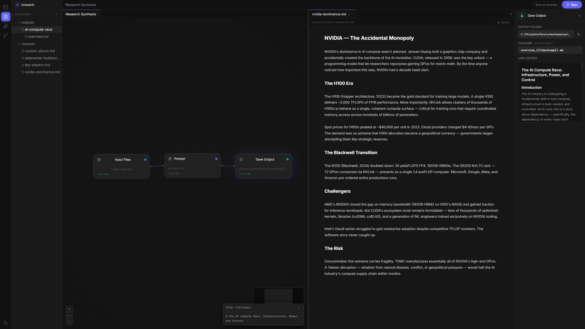

# Hexis

**Visual LLM workflow automation for your local files.** Connect Input → Prompt → Output nodes on a canvas, write your prompts once, and re-run the same workflow on new documents with a single keystroke — on your machine, no cloud required.

The prompts and the workflow are just files in your project folder. Version them with git, tweak them, share them. Think of it as a Makefile for knowledge work: define the process once, run it reproducibly forever.


---

## Example use cases

- **Research synthesis** — point 10 source files at a prompt, get a structured essay every time
- **Weekly summaries** — drop new notes into a folder, run the workflow, get a summary file committed to git
- **Document transformation** — reformat, translate, or extract structured data from any set of files
- **Multi-step pipelines** — chain prompts (outline → draft → edit) or mix LLM calls with Agent nodes that can write and run code

---

## What it does

- **Visual node canvas** — connect Input → Prompt → Output nodes with drag-and-drop
- **Obsidian-style markdown editor** — live preview with heading concealment, inline formatting
- **Smart caching** — only re-runs nodes whose inputs or prompts have actually changed
- **Git integration** — auto-commits every run output, full history in the sidebar
- **Prompt files** — prompts are `.prompt.md` files versioned alongside your documents
- **Agent nodes** — full Claude Code CLI agent with tool use, not just a single LLM call
- **Notion integration** — read from and write to Notion databases
- **Multiple backends** — Claude CLI, Anthropic API, OpenAI, Gemini

---

## Stack

| Layer | Tech |
|---|---|
| Desktop shell | [Tauri](https://tauri.app) (Rust) |
| Frontend | React + TypeScript + [React Flow](https://reactflow.dev) |
| Backend | Python · FastAPI · SQLite |
| LLM (default) | [Claude Code CLI](https://github.com/anthropics/claude-code) |
| Editor | CodeMirror 6 |

---

## Prerequisites

- [Node.js](https://nodejs.org) ≥ 18
- [Rust](https://rustup.rs) (for Tauri)
- Python ≥ 3.11
- [Claude Code CLI](https://github.com/anthropics/claude-code) — `npm i -g @anthropic-ai/claude-code` then `claude login`

---

## Development

```powershell
# 1. Install frontend dependencies
npm install

# 2. Install Python dependencies
cd backend
pip install -r requirements.txt
cd ..

# 3. Start everything (backend + Tauri dev window)
./start-dev.ps1
```

The backend runs on `http://127.0.0.1:7799`. The Tauri window hot-reloads on frontend changes.

---

## Building a release binary

```powershell
npm run tauri build
```

The installer is output to `src-tauri/target/release/bundle/`.

---

## Project structure

```
hexis/
├── src/              # React frontend
├── src-tauri/        # Tauri shell (Rust)
├── backend/          # FastAPI backend (Python)
│   ├── main.py       # REST + SSE endpoints
│   ├── engine.py     # Workflow execution engine
│   └── models.py     # SQLite schema
├── start-dev.ps1     # Dev startup script
└── SPEC.md           # Architecture spec
```

Workspaces (your documents and workflow files) are stored in `~/Hexis/workspaces/` by default — outside the repo, never committed.

---

## License

MIT
